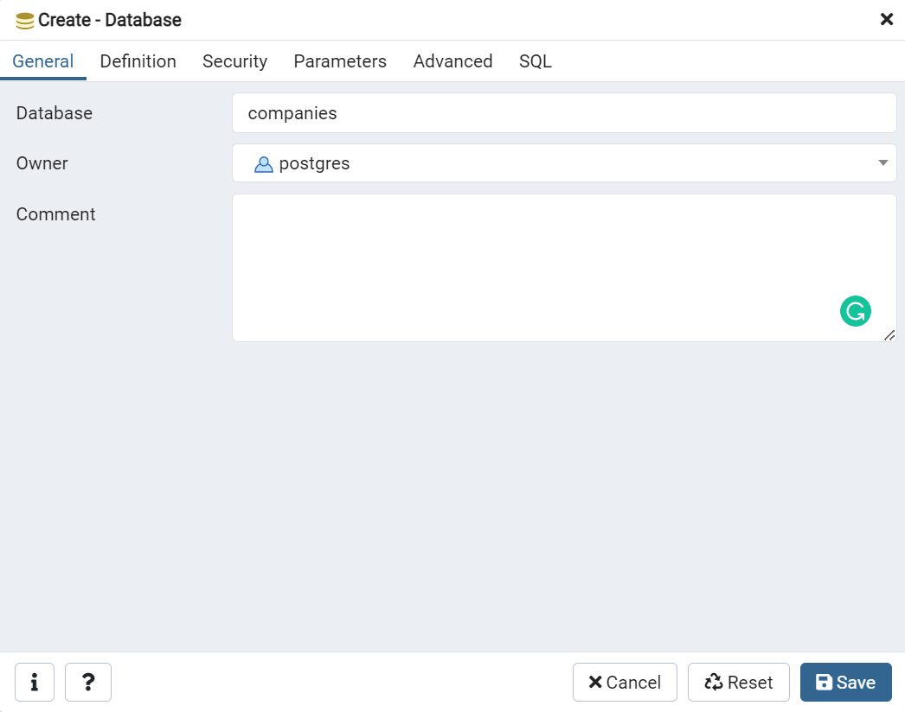

# Backend

## Installation Instructions
1. Create a virtual environment (venv). It is needed to manage packages versions between different projects.
*Note*: the env will be enabled in your terminal.
- Windows
	```
	py -3 -m venv venv
	venv\Scripts\activate
	```
- MacOS/Linux
	```
	python3 -m venv venv
	. venv/bin/activate
	```
2. After activating your virtual environment install all the necessary dependencies:
```
pip install -r requirements.txt
```
3. Copy a `.env.example` file to the same directory and rename it to `.env`. This file stores all sensitive and configurable data
4. Run the development server locally using the following command:
```
flask --app flaskr run
```
By default, the server will run on `http://127.0.0.1:5000`

## Local Database Setup
- Install [PostgreSQL](https://www.postgresql.org/download/)
- Install [pgadmin](https://www.pgadmin.org/download/)
- Create a database called `companies` using `pgadmin`
  
